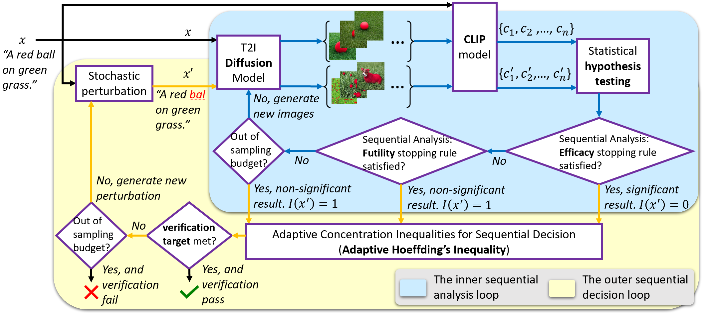
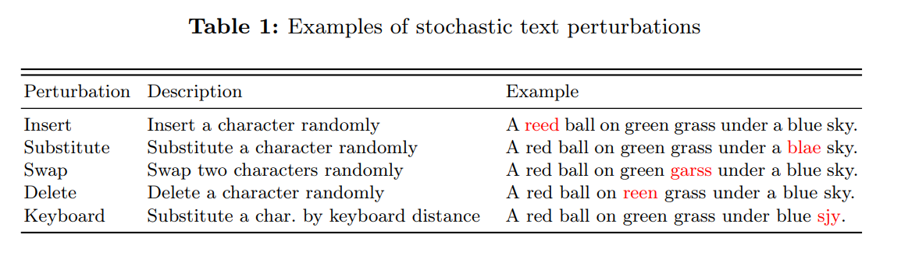
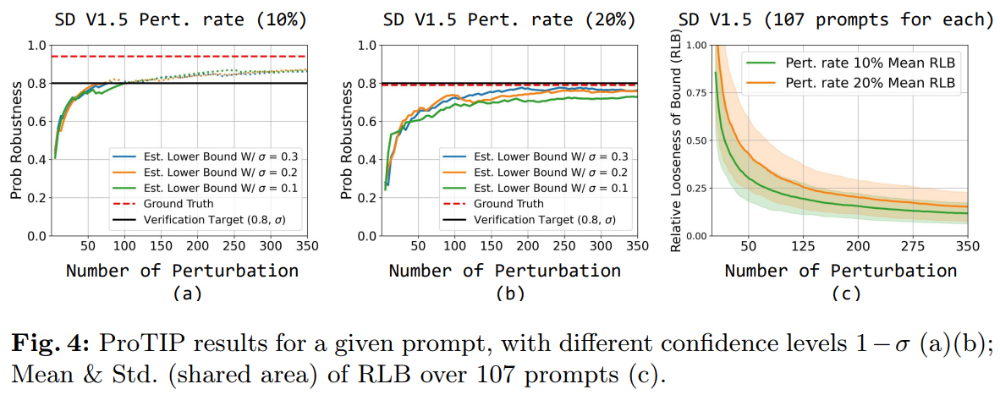
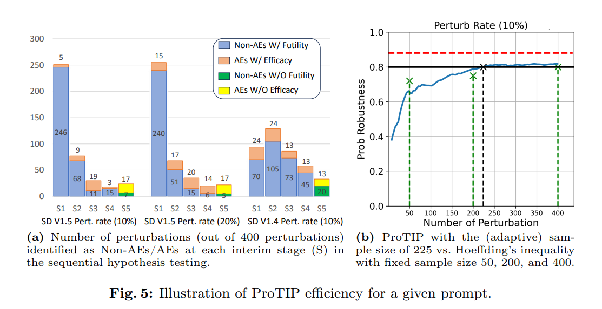
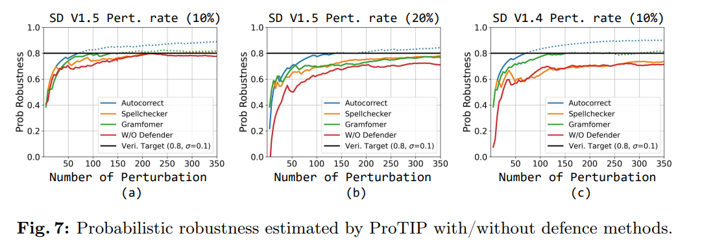

# ProTIP: Probabilistic Robustness Verification on Text-to-Image Diffusion Models against Stochastic Perturbation
[
[
[


## Overview

<p align="center">
    
</p>

## Abstract
Text-to-Image (T2I) Diffusion Models (DMs) have
shown impressive abilities in generating high-quality images based on simple text descriptions. However, as is common with many Deep Learning (DL) models, DMs are subject to a lack of robustness.
While there are attempts to evaluate the robustness of T2I DMs as a binary or worst-case problem, they cannot answer how robust in general the model is whenever an adversarial example (AE) can be found.
In this study, we first introduce a probabilistic notion of T2I DMs' robustness; and then establish an efficient framework, ProTIP, to evaluate it with statistical guarantees. The main challenges stem from: (i) the high computational cost of the generation process; and (ii) determining if a perturbed input is an AE involves comparing two output distributions, which is fundamentally harder compared to other DL tasks like classification where an AE is identified upon misprediction of labels.
To tackle the challenges, we employ sequential analysis with efficacy and futility early stopping rules in the statistical testing for identifying AEs, and adaptive concentration inequalities to dynamically determine the just-right number of stochastic perturbations whenever the verification target is met.
Empirical experiments validate the effectiveness and efficiency of ProTIP over common T2I DMs. Finally, we demonstrate an application of ProTIP to rank commonly used defence methods.


## Installation
The code has been tested with the following environment:
```angular2html
git clone https://github.com/wellzline/ProTIP.git
cd ProTIP
conda env create --name ProTIP
source activate ProTIP
pip install -r requirements.txt
```

## Data Preparation

```angular2html
cd generate_AE
python char_level.py
```

<p align="center">
    
</p>

```angular2html
|-- generate_AE
|   |-- coco
|   |   |-- char_AE
|   |   |   |-- result_1.csv
|   |   |   |-- result_2.csv
|   |   |   |-- ..
|   |-- origin_prompts
|   |   |-- coco.txt
|   |   |-- candidates.txt
|   |-- attack_test.py
|   |-- char_level.py
|   |-- word_level.py
```

## Verification Experiment

### Config
```angular2html
origin_prompt_path = "./generate_AE/origin_prompts/coco.txt"

num_inference_steps = 50
num_batch = 5  
batch_size = 12
model_id = "runwayml/stable-diffusion-v1-5"

e_threshold = 0.08
sigma = 0.3
stop_early = 0
```

### Run
```angular2html
python version_sample.py
```

### Defence 
```angular2html
python version_defence.py
```

## Example Result
<p align="center">
    
    
    
</p>

## Acknowledgements
- Models
  - [Stable Diffusion V1.5](https://github.com/runwayml/stable-diffusion)
  - [Stable Diffusion V1.4](https://github.com/CompVis/stable-diffusion)
- Data acquisition and processing
  - [MS COCO](https://cocodataset.org/#home)

## Citation
If you find this repo useful, please cite:
```
coming
```

## Remark


